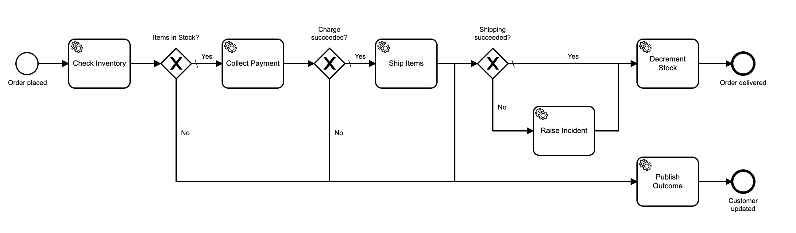

# Zeebe Ecommerce Demo

This is the "TODO app" of [Zeebe](https://zeebe.io) demos: an ecommerce flow.



You can use this demo to see:

- How a Microservices architecture could be used to service a business process with Zeebe.
- How to write Node.js clients for Zeebe.
- How to integrate Zeebe into a REST architecture. 
- How to retrieve workflow outcomes for external requestors (Keep an eye on [this issue](https://github.com/zeebe-io/zeebe/issues/2896)).
- How long end-to-end execution of a workflow takes in various load scenarios.

## Setup

- Install dependencies with `npm i && npm i -g ts-node typescript`.
- Use the `operate` or `broker-only` profile of [zeebe-docker-compose](https://github.com/zeebe-io/zeebe-docker-compose) to start the broker.

The file `rest-server/config.ts` configures the number of workflows that will be executed in parallel. You can set it to `1` to execute workflows sequentially to get a sense of the end-to-end execution time of the workflow. You can run `cyber-monday` with 1000 iterations and the parallel workflows set to 1000 to run them all in parallel, and anything in between.

- Start the REST server: `cd rest-server && ts-node index.ts`
- Start each of the microservices in a separate terminal:

```bash
cd microservices
npm run inventory
npm run payment
npm run ships
```

The webstore is running on localhost:3000/shop. It's a dummy at the moment, and the client API requests are emulated in `rest-client`.

- Start workflows:

```bash
cd rest-client
ts-node zeebe-osc-pack.ts           // a single order
ts-node zeebe-osc-pack-invalid.ts   // single order with invalid payment
ts-node cyber-monday.ts             // a flood of orders
```

The `cyber-monday` scenario is configured in `microservices/cyber-monday.ts`. Set the `NUMBER_OF_ORDERS` variable to the number of orders to flood the system with. 

If you start the Operate profile, then Operate is running on [http://localhost:8080](http://localhost:8080). Login is demo/demo.

Experiment with making orders, with all microservices running, and with various ones in a failure state.

## Run on Camunda Cloud

To run on Camunda Cloud:

* Get an account in the closed beta [here](https://zeebe.io/cloud/).
* Create a new Zeebe cluster.
* Create a new client in the console.
* Put your credentials in the `zeebe-broker-config.ts` file.
* Run each Node microservice component with this in front of the command to start it: `PROFILE=CLOUD`, for example: `cd microservices && PROFILE=CLOUD npm run inventory`